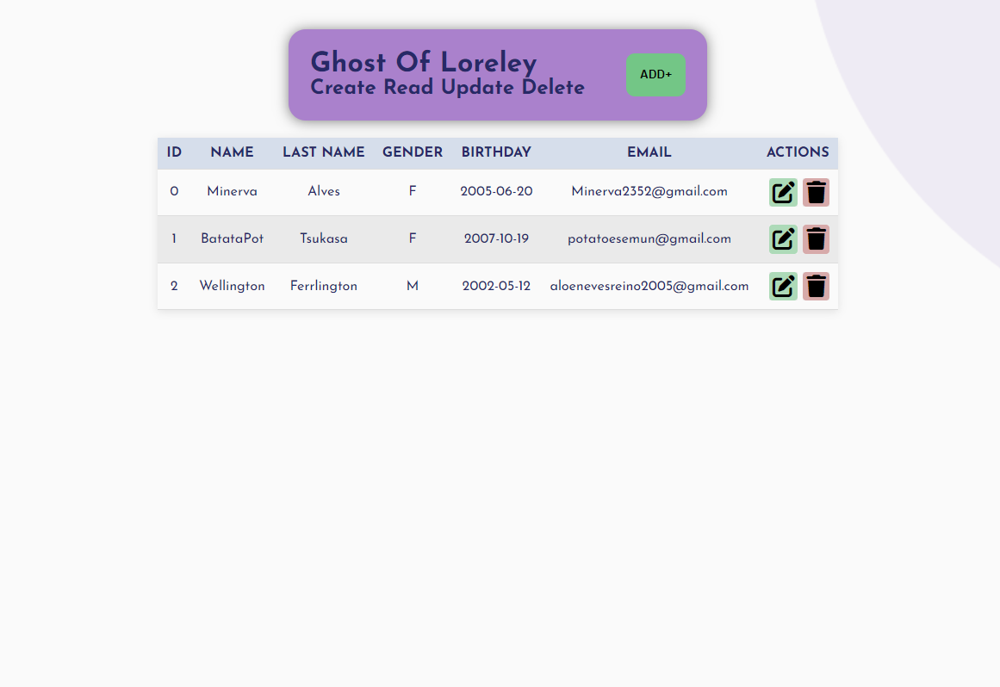
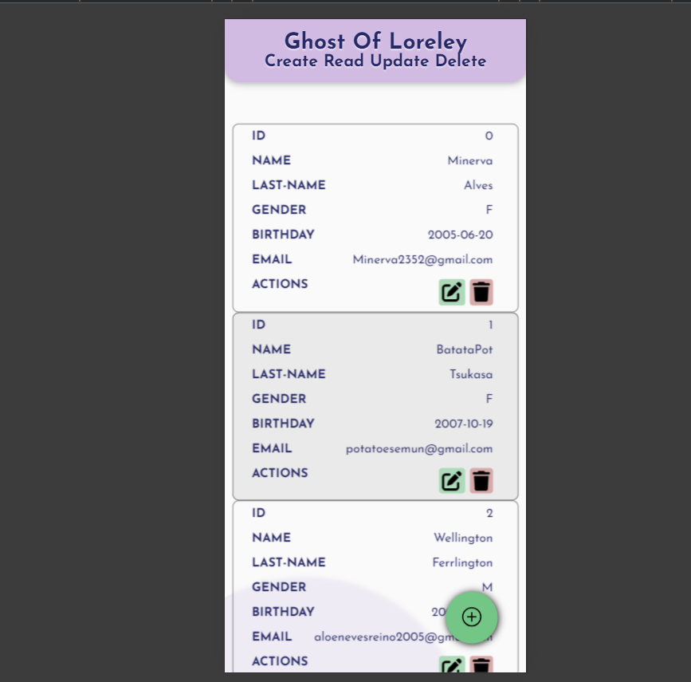
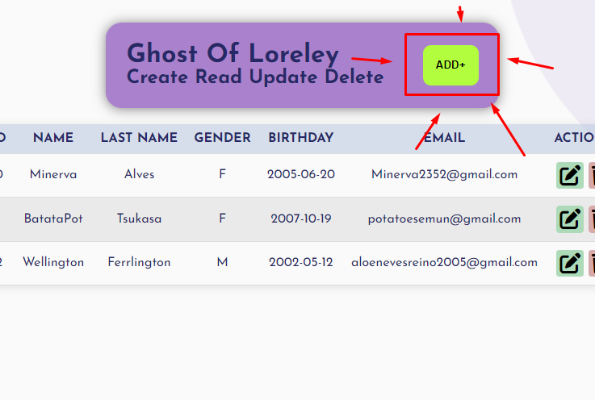
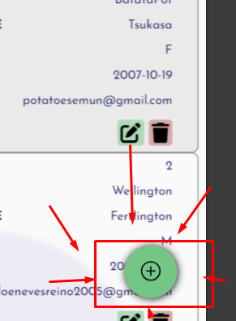
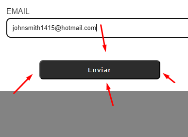
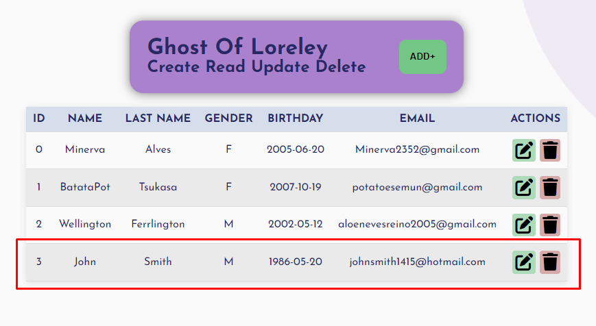
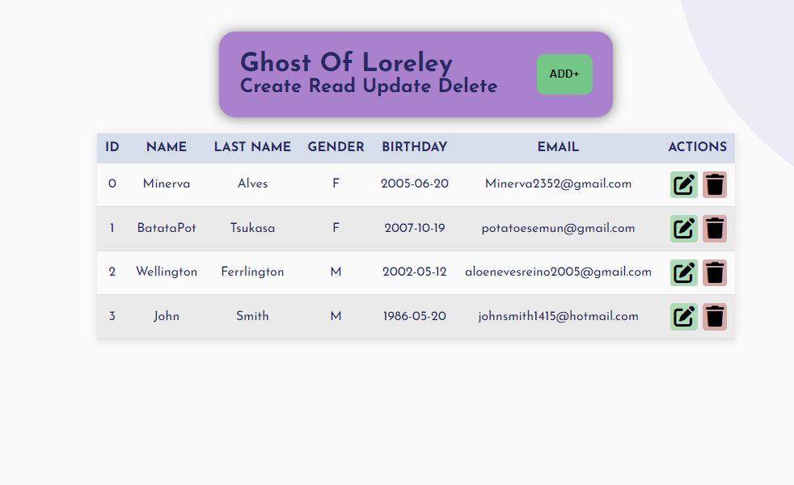
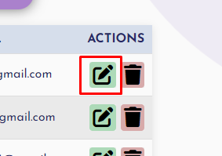
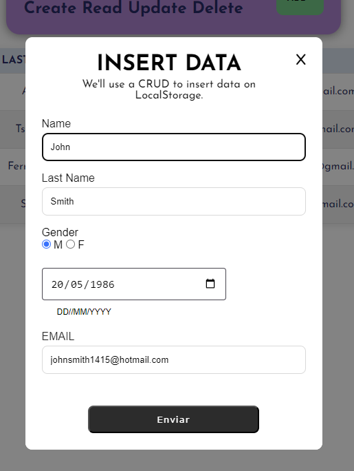
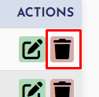

# Ghost Of Loreley - CRUD
This is my first CRUD did in Javascript. 
The Ghost Of Loreley CRUD saves data on LocalStorage on browser, and load data from LocalStorage. It's possible to CREATE, to READ, to UPDATE and to DELETE.

### HOME
  

**What is CRUD?**

- C - [CREATE](#create)
- R - [READ](#read)
- U - [UPDATE](#update)
- D - [DELETE](#delete)

----
## CREATE

> How to create a data?

#### 1. Press ADD BUTTON on Desktop or Floating Add Button on Mobile
  

#### 2. Fill the form with data
 

#### 3. Submit form

#### 4. Data on the form

## READ
> All the home page is READ area 
> 

### UPDATE
---
> How to update data

#### 1. Click on green edit button

#### 2. Change data

### DELETE

> How to delete data

#### 1. Click on delete edit button

#### 2. After delete

